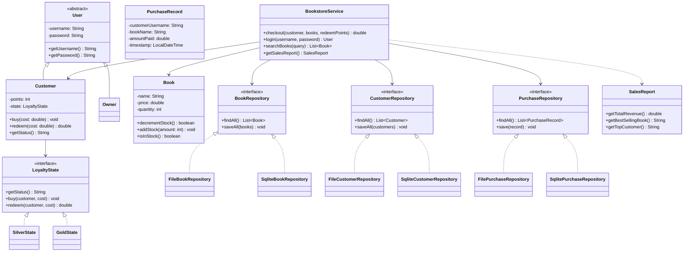

# 📚 Bookstore Management System

A Java desktop application for running a bookstore: an owner manages inventory, restocking, and customer accounts, while customers log in to browse stock, purchase books, and earn loyalty rewards. Built with a layered architecture, a pluggable persistence layer (flat file or SQLite), and a full JUnit 5 test suite.


## Features

- **Role-based login** — an owner/admin account plus any number of customer accounts
- **Stock-tracked inventory** — add, restock, search, and delete titles; purchases decrement quantity and a title only disappears once it's actually out of stock
- **Loyalty points system (State pattern)** — customers earn points per dollar spent and move between Silver and Gold tiers; Gold customers who redeem down below the threshold drop back to Silver
- **Point redemption at checkout** — pay full price or redeem points against the cart total
- **Live search** — filter the catalog by name, on both the owner and customer screens
- **Sales reporting** — total revenue, units sold, best-selling title, and top customer by spend, computed from a logged purchase history
- **Pluggable persistence** — run against flat files (`books.txt` / `customers.txt` / `purchases.txt`) or a SQLite database (`bookstore.db`), chosen with a command-line flag

## Tech stack

- Java 17, Swing
- Maven
- SQLite via JDBC (`org.xerial:sqlite-jdbc`)
- JUnit 5
- GitHub Actions (CI on every push/PR)

## Architecture

`BookstoreService` depends only on the repository *interfaces*, so business logic never knows or cares whether data is coming from flat files or SQLite — swapping the backend is a one-line change (`BookstoreService.using(PersistenceType.SQLITE)`).



## Getting started

**Requirements:** JDK 17+, Maven.

```bash
git clone https://github.com/amaraulakh956/Bookstore-Management-System.git
cd Bookstore-Management-System
mvn clean package
```

Run with flat-file storage:

```bash
java -jar target/bookstore-app.jar
```

Run with SQLite storage instead:

```bash
java -jar target/bookstore-app.jar --db=sqlite
```

Log in as the owner with `admin` / `admin`, or add a customer account from the Owner → Customers screen and log in as them.

## Running the tests

```bash
mvn test
```

Covers loyalty point math (earning, redemption, tier transitions), stock-aware checkout, duplicate/validation rules, search, and both persistence backends — using JUnit 5's `@TempDir` so tests never touch real data files.

## Possible next steps

- Hash stored passwords (e.g. BCrypt) instead of storing them in plaintext
- Multi-quantity checkout (buy 2 of the same title in one transaction) instead of one checkbox per copy
- Export the sales report to CSV

---

*Original class and use-case diagrams from an earlier iteration of this project are kept in [`docs/`](docs) for reference; they predate the current architecture.*
